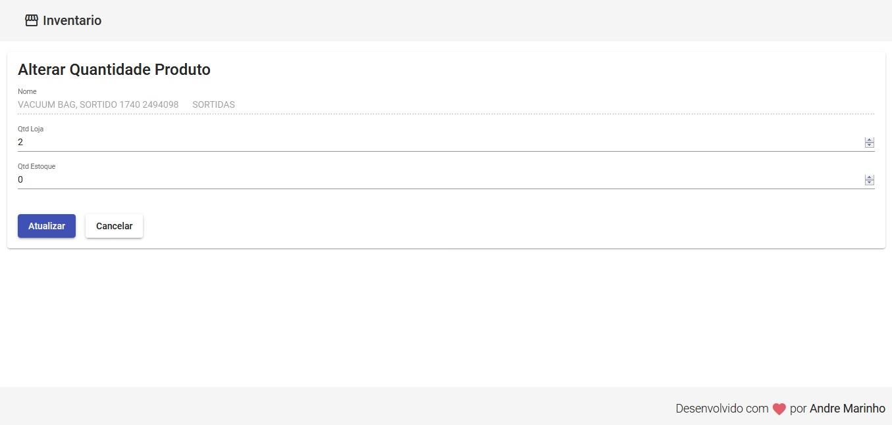

# webinventario
## Sistema de inventario baseado nas tecnologias mysql, Angular e Spring Boot

### Um sistema  pra ser utilizado para estudo.

### Tecnologias utilizadas:

1. Angular 

 O fluxo do sistema é bastante simples, porém funcional.  a primeira tela consulta um codigo e caso exista o codigo na base. 

### Fluxo:

>Tela 01: Consulta do código do produto.

Tela 01: Tela de cosulta do codigo e validação, caso o codigo exista na base de dados, então na proxima tela será exibido o produto carregado. 

***

>Tela 02: Inclusão e Atualização da quantidade dos produtos.

Tela 02: Caso o código seja valido então o  sistema permite a inclusão ou atuluzação das quantidades.

